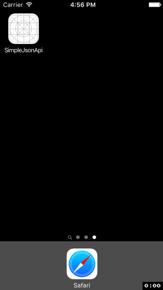

# Simple JSON API

My example of sinple JSON API

We will use Yahoo service for get rates fo currencies: 

- US dollar / Russian ruble  
- Euro / Russian ruble  
- Chilean peso / Russian ruble  

```sh
http://query.yahooapis.com/v1/public/yql?q=select * from yahoo.finance.xchange where pair in ("USDRUB,EURRUB,CLPRUB")&format=json&env=store://datatables.org/alltableswithkeys
```

Response:

```json
{
  "query": {
    "count": 3,
    "created": "2016-05-18T17:40:06Z",
    "lang": "en-US",
    "results": {
      "rate": [
        {
          "id": "USDRUB",
          "Name": "USD/RUB",
          "Rate": "65.2520",
          "Date": "5/18/2016",
          "Time": "6:39pm",
          "Ask": "65.2720",
          "Bid": "65.2520"
        },
        {
          "id": "EURRUB",
          "Name": "EUR/RUB",
          "Rate": "73.6401",
          "Date": "5/18/2016",
          "Time": "6:40pm",
          "Ask": "73.6660",
          "Bid": "73.6143"
        },
        {
          "id": "CLPRUB",
          "Name": "CLP/RUB",
          "Rate": "0.0946",
          "Date": "5/18/2016",
          "Time": "6:39pm",
          "Ask": "0.0947",
          "Bid": "0.0946"
        }
      ]
    }
  }
}
```

# Example



# Libraries

- [https://github.com/AFNetworking/AFNetworking](https://github.com/AFNetworking/AFNetworking)
- [https://github.com/jdg/MBProgressHUD](https://github.com/jdg/MBProgressHUD)

# Todo

- Use [#128: NSURLQueryItem & NSURLComponents](https://littlebitesofcocoa.com/128-nsurlqueryitem-nsurlcomponents)
- Async [https://github.com/maybewaityou/Async](https://github.com/maybewaityou/Async)